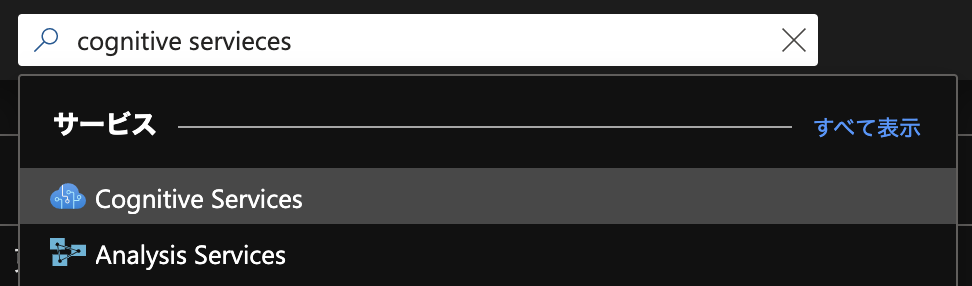
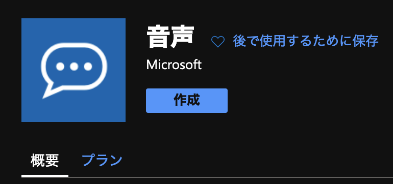
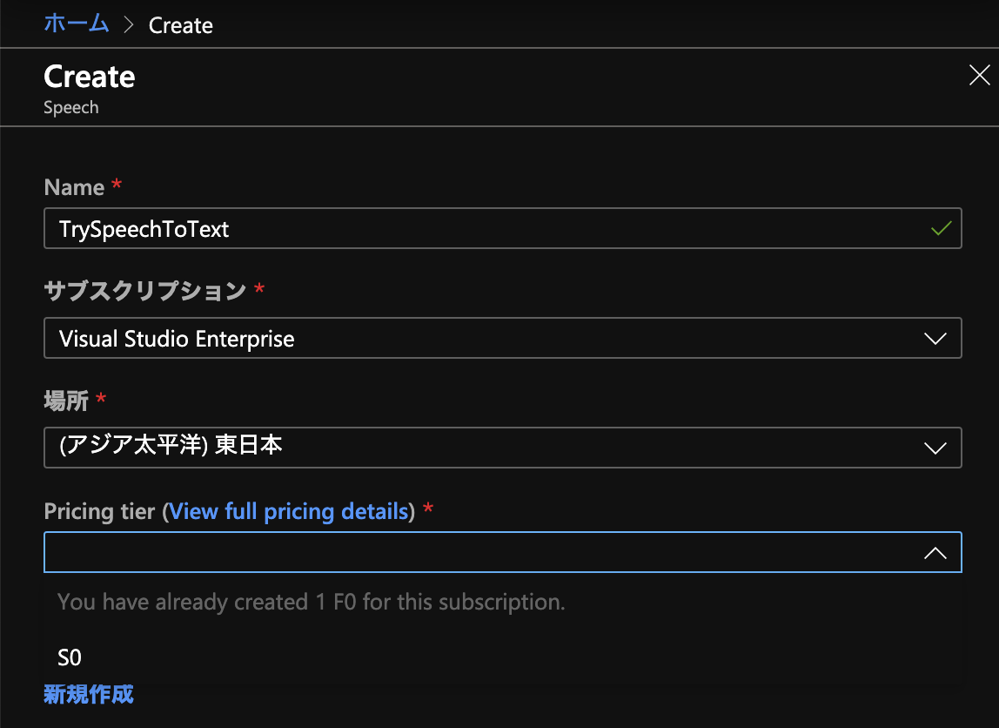
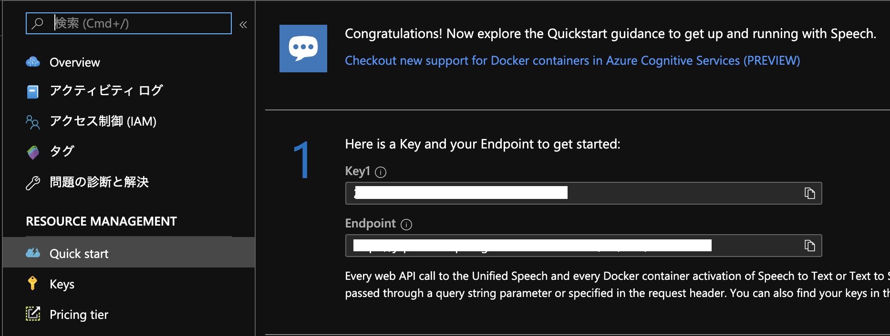

メリークリスマス！（遅刻）

[Azure AI Advent Calendar 2019](https://qiita.com/advent-calendar/2019/azure-ai) 25日目のエントリーです。

みなさんクリスマスイブからクリスマスにかけていかがお過ごしでしたか？
私は本記事を書くために進捗の6時間を過ごして寝不足です。

さて、今回はAzure Cognitive Servicesの中の一つである、Speech ServiceのSpeech to Textの使い方や使ってみた結果などを紹介していきます。
実際に動かしてみたコードも載せるので、試してみたいけど書くの面倒だし…という方も安心してお読み下さい。

[音声変換 - Speech Service - Azure Cognitive Services | Microsoft Docs](https://docs.microsoft.com/ja-jp/azure/cognitive-services/speech-service/speech-to-text?WT.mc_id=AI-MVP-5002987)

## 用意するもの

* Azureのサブスクリプション
* .NET Core 3.0のアプリケーションがビルド出来る環境
* 書き起こししたい音声

## 始めてみよう

### Cognitive Servicesのプロジェクトを作る

まずはCognitive Servicesのディレクトリを開きましょう。
Azure PortalのSearchフォームに`cognitive services`と打ち込んで、ディレクトリに移動しましょう。



Cognitive Servicesのディレクトリに移動したら、追加ボタンを押してどのServiceを使うか指定します。
日本リージョンで使っている場合`Speech to Text`とかで検索をかけると他のMarketplaceのServiceが引っかかってしまいます。
日本リージョンで使っている場合は`音声`と調べると目的のServiceが出てきます。



作成を押して適当な名前をつけます。
お試しで使ってみたい場合はPricing tierをF0にすると良いでしょう（画像では既にF0 tierを使っているので選択出来ないように鳴っています…）



設定を済ませCreateを押すとプロジェクトが作成されます。
遷移先のページで暫く待つと準備が出来るのでそれまでコーヒーでも飲んで待ちましょう。

準備が出来たあとサイドペインのQuick startを押すとどうすれば使うことが出来るのかが表示されます。
本記事紹介するフローじゃない場合はこれを見ていい感じに頑張りましょう。

今回サンプルで紹介するプロジェクトを使う場合は



上記の画像にある`Key1`と`Endpoint`は後々使うのでどこかしらにメモしておきましょう。

以上でプロジェクト自体の容易は完了です。

### アプリケーションを作る

とりあえず動くサンプルコードをこちらに用意しました。
コード書きたくない、けど試してみたいという方はこちらをビルドして試してみて下さい。

https://github.com/yamachu/TryCognitiveSpeechToText

こちらのコードを使わない場合、Quick startに沿って進めれば大体いい感じになります。
自分の目的に合わせてやりたいなぁという方は

[クイック スタート:オーディオ ファイルから音声を認識する - Speech サービス - Azure Cognitive Services | Microsoft Docs](https://docs.microsoft.com/ja-jp/azure/cognitive-services/speech-service/quickstarts/speech-to-text-from-file?tabs=linux&pivots=programming-language-csharp&WT.mc_id=AI-MVP-5002987)

を見て頑張ってみてください。

今回は自分の用意したサンプルコードと上記のクイックスタートを照らし合わせて解説していきます。
上記のクイックスタートでは15秒未満の音声のみを対象としたものですが、15秒以上の音声を対象とすることも考え連続音声認識方式で行っています。


1. SpeechConfigを生成する

[SpeechConfigを作成する - Speech サービス - Azure Cognitive Services | Microsoft Docs](https://docs.microsoft.com/ja-jp/azure/cognitive-services/speech-service/quickstarts/speech-to-text-from-file?pivots=programming-language-csharp&tabs=linux#create-a-speech-configuration&WT.mc_id=AI-MVP-5002987)

```cs
static SpeechConfig InitializeSpeechConfig(string endpoint, string subscriptionKey) =>
    SpeechConfig.FromEndpoint(new Uri(endpoint), subscriptionKey).Also(m =>
    {
        m.SpeechRecognitionLanguage = "ja-JP"; // 日本語の音声を認識したいので設定
        m.OutputFormat = OutputFormat.Detailed; // 必要はないが、信頼度などのパラメータが欲しい場合はDetailedに設定する
    });
```

普段見ない`Also`などが出ていますが、これは拡張メソッドで見慣れている形に書き直すと

```cs
var config = SpeechConfig.FromEndpoint(new Uri(endpoint), subscriptionKey);
config.SpeechRecognitionLanguage = "ja-JP";
config.OutputFormat = OutputFormat.Detailed;
return config;
```

と同等です。
いい感じに読み替えて下さい。

ここの`endpoint`と`subscriptionKey`は前節でメモをした`Endpoint`と`key1`が対応しています。

2. AudioConfigを作成し、認識結果を取得するコールバックを設定する

[AudioConfigを作成する - Speech サービス - Azure Cognitive Services | Microsoft Docs](https://docs.microsoft.com/ja-jp/azure/cognitive-services/speech-service/quickstarts/speech-to-text-from-file?pivots=programming-language-csharp&tabs=linux#create-an-audio-configuration&WT.mc_id=AI-MVP-5002987)
[認識結果 (またはエラー) を表示する - Speech サービス - Azure Cognitive Services | Microsoft Docs](https://docs.microsoft.com/ja-jp/azure/cognitive-services/speech-service/quickstarts/speech-to-text-from-file?pivots=programming-language-csharp&tabs=linux#display-the-recognition-results-or-errors&WT.mc_id=AI-MVP-5002987)

```cs
using var audioConfig = AudioConfig.FromWavFileInput(f);
using var recognizer = new SpeechRecognizer(config, audioConfig).Also(r =>
{
    // e is SpeechRecognitionEventArgs
    // refs: https://docs.microsoft.com/ja-jp/dotnet/api/microsoft.cognitiveservices.speech.speechrecognitioneventargs?view=azure-dotnet
    r.Recognized += (_, e) => e.Result.Also(result =>
    {
        if (result.Reason == ResultReason.RecognizedSpeech)
        {
            resultSubject.OnNext(result.Best().FirstOrDefault().Let(r => new RecognitionResult()
            {
                File = f,
                Result = r.Text,
                Confidence = r.Confidence,
            }));
        }
    });

    r.SessionStopped += (_, __) => recognitionRunningSubject.OnNext(true);
});
```

今回のコードでは、認識したいファイル一つごとに`AudioConfig`と`SpeechRecognizer`を生成しています。
`SpeechRecognizer.Recognized`のコールバックでは認識結果を取得することが出来ます。
今回は認識結果と、その認識結果の信頼度を出力しています。

3. 語句を認識する

[語句を認識する - Speech サービス - Azure Cognitive Services | Microsoft Docs](https://docs.microsoft.com/ja-jp/azure/cognitive-services/speech-service/quickstarts/speech-to-text-from-file?pivots=programming-language-csharp&tabs=linux#recognize-a-phrase&WT.mc_id=AI-MVP-5002987)

上記リンクでは[RecognizeOnceAsync](https://docs.microsoft.com/ja-jp/dotnet/api/microsoft.cognitiveservices.speech.speechrecognizer.recognizeonceasync?view=azure-dotnet&WT.mc_id=AI-MVP-5002987)メソッドを使っています。
こちらのメソッドだとドキュメントにあるように

> Starts speech recognition, and returns after a single utterance is recognized. The end of a single utterance is determined by listening for silence at the end or until a maximum of 15 seconds of audio is processed. 

最大15秒の無音を含まないような単一発話をターゲットとしているので、少し長めの音声には適していません。

そのため、本サンプルでは[StartContinuousRecognitionAsync](https://docs.microsoft.com/en-us/dotnet/api/microsoft.cognitiveservices.speech.speechrecognizer.startcontinuousrecognitionasync?view=azure-dotnet&WT.mc_id=AI-MVP-5002987)を使用しました。

```cs
await recognizer.StartContinuousRecognitionAsync().ConfigureAwait(false);

while (!recognitionRunningSubject.Value)
{
    await Task.Delay(200); // 何秒ごとにフラグが変わるかのポーリングの秒数なのでお好きにどうぞ
}

await recognizer.StopContinuousRecognitionAsync().ConfigureAwait(false);
```

2.の`SessionStopped`で入力した音声ファイルの認識が終了したかが取得できるので、そこのイベントの結果を見て、それが起こるまでwhileループで待っている、みたいな漢字のコードになっています（いい感じに書けなかったので誰かPRお待ちしておりますｗ）。

以上のコードを使用することで認識をスタートすることが出来ます。

### 音声を用意する

前節でファイルを認識する準備ができました。
それでは実際に音声を認識してみましょう。

今回は話者数が少なく、BGMも無い音声を認識してみます。
題材としたのはよく聞いている[ajitofm](https://ajito.fm/)の[vol.54](https://ajito.fm/54/)を使用してみました。

本実験に関して音声の使用を快諾してくださった権利者の方々に感謝いたします。

Azure Cognitive Services Speech Services Speech to Textでは16bitの8or16kHzのwavファイルが入力としてサポートされています。

[サポートされるオーディオ入力の形式 - Speech サービス - Azure Cognitive Services | Microsoft Docs](https://docs.microsoft.com/ja-jp/azure/cognitive-services/speech-service/quickstarts/speech-to-text-from-file?pivots=programming-language-csharp&tabs=linux#supported-audio-input-format&WT.mc_id=AI-MVP-5002987)

今回の対象音声はmp3でサポートされているフォーマットと合致しません。
今回は[SoX（Sound eXchange）](http://sox.sourceforge.net/)を使って対象の音声に変換します。

Macであればbrewで入れることが出来ます。

使い方はhelpなどを見て欲しいのですが、

```sh
$ sox target.mp3 -r 16000 target.wav
```

みたいな感じで、target.mp3をtarget.wavに16kHzにダウンサンプルして変換することが出来ます。
SoX以外でも同様の処理は可能なのでお好きなアプリケーションをお使い下さい。

さて、これでフォーマットに合致した音声が生成することが出来ました。

これでもうCognitive Servicesを使って音声認識をすることは出来るのですが、オプショナルとして無音区間で区切った音声を以上のファイルから作ってみたいと思います。

無音区間で区切ることで、音声と書き起こしの対応が付けやすいのと、今後別のサービスを使用する時に便利になったりします（後述）。

この無音区間での分割には[Juliusのadintool](https://github.com/julius-speech/julius/blob/master/adintool/README.ja.md)を使用しました。
Juliusも音声認識を行うためのToolkitなので、興味のある方はぜひ試してみて下さい。

adintoolはWindowsの人であれば[GitHub Releaseページ](https://github.com/julius-speech/julius/releases)からダウンロードすることが出来ます。
MacやLinuxユーザの方はリポジトリをクローンしてビルドして手に入れましょう。

[adintoolのドキュメント](https://julius.osdn.jp/juliusbook/ja/adintool.html)を読んで分割していきます。
ファイル入力の場合はファイル名を標準入力で取得するので、例えば以下のようなコマンドで分割してみます。

```sh
$ echo target.wav| adintool -in file -out file -filename target_separated
```

同一ディレクトリのtarget.wavを入力に使用して、target_separated.{ここに連番}.wavと言うファイルで出力するのが上記のコマンドです。
私は出力されたファイルが、オリジナルのファイルの何サンプル目か何サンプル目であるかをメモっておきたかったので、

```sh
$ echo target.wav| adintool -in file -out file -filename target_separated >& /dev/null| grep -E "^target_separated.*"| sed -E "s;(.*\.wav):.*\[ *([0-9]+).*- ([0-9]+).*;\1 \2 \3;g"
```

こんな感じにしてみました。

### 実際に走らせる

実際に実行するのは非常に簡単です。

https://github.com/yamachu/TryCognitiveSpeechToText

を使用した方はクローンしたディレクトリで

```sh
$ dotnet run --source-dir=${認識したいwavファイルがあるディレクトリ} --endpoint=${メモったEndpoint} --subscription-key=${メモったKey1} --result=${CSVで認識結果を保存したい場合はここにファイル名}
```

みたいな感じで走らせます。
100ファイル合計10分程度のファイルの認識で約5分でした。

認識結果の一部を見てみましょう

ajitofm54.0094.wavの11714236~11897036サンプル目

```
結果: なんか？アメリカ滞在中に面白かった事とか、あります。ええ、クライミングシューズが安かった。全然仕事じゃなかったみたいな。
正:
S: なんか、アメリカ滞在中に面白かった事とか、あります？
K: ええ、クライミングシューズが安かった。
S: 全然仕事じゃなかったみたいな。
```

見事に認識できています。
クライミングシューズっていう普段でなそうなワードも認識出来ていて素晴らしいですね。

しかし複数話者の発話が混じっているので大変です…これに関しては[Speaker Recognition API](https://docs.microsoft.com/ja-jp/azure/cognitive-services/speaker-recognition/home&WT.mc_id=AI-MVP-5002987)が日本語対応すれば、どこの部分を誰が話しているのか認識出来そうなので、期待して待ちましょう。

また

ajitofm54.0079.wavの9774236~9844036サンプル目

```
結果: ソースコード読みたいなと思いながら、まあまだ読んでないけど。
正:
K: ソースコード読みたいなと思いながら
S: ああー（相槌）
K: まだ読んでないけど。
```

相槌が混じってしまっていますが、Domain Specificな単語も認識しています。
バッチリですね……

## 終わりに

Speech to Text APIを使うためにプログラムを書いて、実際に認識するための一連の流れを紹介しました。

一回認識するためのプログラムを用意してしまえば、あとは音声を用意するだけで簡単に書き起こしが出来ちゃいます。

今回紹介できませんでしたが（日本語対応とかしていないというのもあるけど）、認識精度を上げるために[話者モデル](https://docs.microsoft.com/ja-jp/azure/cognitive-services/speech-service/how-to-custom-speech-train-model&WT.mc_id=AI-MVP-5002987)を作ったり、前述した[Speaker Recognition API](https://docs.microsoft.com/ja-jp/azure/cognitive-services/speaker-recognition/home&WT.mc_id=AI-MVP-5002987)を使用することにより、更に書き起こし業務が簡単になりそうです。

これらをするにはある程度ファイルを分割しておいたほうが楽なので、音声準備の段階で無音区間でファイルを分割みたいなことを推奨していました。

またSpeech to Textサービスはリアルタイムのマイク入力も対応しているので、後々書き起こしがしたい音声の録音時にそのまま書き起こしさせたりすることが出来ます。
また話者毎の認識精度を上げるためにマイクを別々に用意して、各話者毎に録音するなどの工夫次第でどんどん使いやすくなるのでぜひチャレンジしてみて下さい。

---

さて[Azure AI Advent Calendar 2019](https://qiita.com/advent-calendar/2019/azure-ai)完走です！

面白い記事を投稿してくださった皆様、本当にありがとうございました。
AzureのAI技術面白いものがまだまだたくさんあります。

ぜひ多くのサービスを試して、こういうことが出来そう、出来たなどの例や、ここで詰まったーこうすると良いよ、みたいな知見を投稿して良いコミュニティが生まれたらいいなと覆います。

来年もAzure AIをよろしくお願いいたします！（誰）
